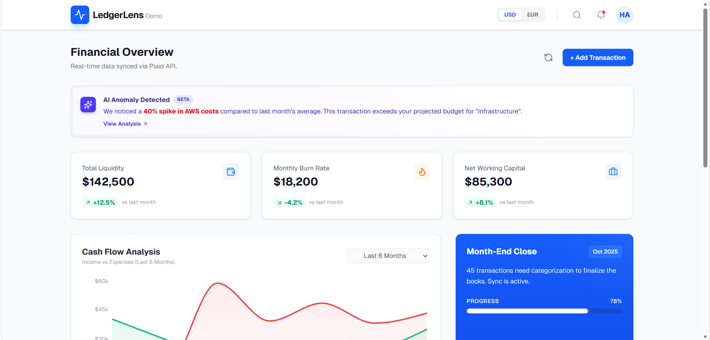

# LedgerLens: The CFO Financial Dashboard


## 🚀 Overview
**LedgerLens** is a modern, high-performance financial dashboard designed to visualize complex accounting data for decision-makers.

**The Unique Angle:** This project was built by a **Frontend Engineer with a background as a Certified Accountant**. It addresses the common disconnect between technical implementation and financial logic, ensuring data accuracy, proper ledger formatting, and accountant-friendly features.

🔗 **Live Demo:** [text](https://ledger-lens-seven.vercel.app/)

---

## 🎯 Key Features

### 1. Financial Health Visualization
- **Real-time Cash Flow:** Interactive Area Charts using `Recharts` to visualize Income vs. Expenses over time.
- **Key Performance Indicators (KPIs):** Instant view of Total Liquidity, Net Working Capital, and Monthly Burn Rate with trend analysis.

### 2. The "Accountant-First" Features
- **CSV Export Engine:** Because every finance team lives in Excel. I implemented a client-side CSV generator that formats ledger data correctly for external analysis.
- **Currency Toggle:** Global-ready state management handling multi-currency views (USD/EUR) with proper localization formatting.

### 3. Modern UI/UX
- **AI Insight Widget:** A mock implementation of automated anomaly detection (e.g., flagging unexpected spikes in AWS costs).
- **Responsive Design:** Fully optimized for desktop and tablet views using Tailwind CSS.

---

## 🛠️ Tech Stack

- **Framework:** [Next.js 14](https://nextjs.org/) (App Router)
- **Language:** TypeScript (Strict Mode)
- **Styling:** Tailwind CSS
- **Visualization:** Recharts
- **Icons:** Lucide React
- **Deployment:** Vercel

---

## 💡 Engineering Decisions & "Accountant Logic"

As someone who speaks both **Code** and **Finance**, I made specific architectural decisions:

1.  **Integer Math:** To avoid JavaScript's floating-point errors (e.g., `0.1 + 0.2 !== 0.3`), all monetary values are handled as integers (cents) in the logic layer and formatted only at the presentation layer.
2.  **Component Architecture:** The dashboard is modular. The `TransactionTable`, `KPIWidget`, and `CashFlowChart` are isolated components to ensure maintainability.
3.  **Performance:** Used React's `useState` for rapid UI updates (currency switching) without unnecessary full-page reloads.

---

## 🚀 Getting Started

First, run the development server:

```bash
npm run dev
# or
yarn dev
